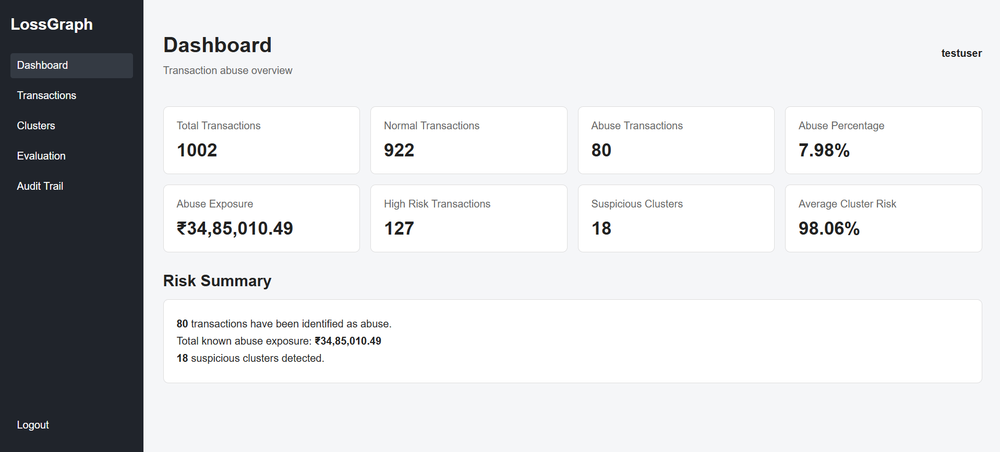
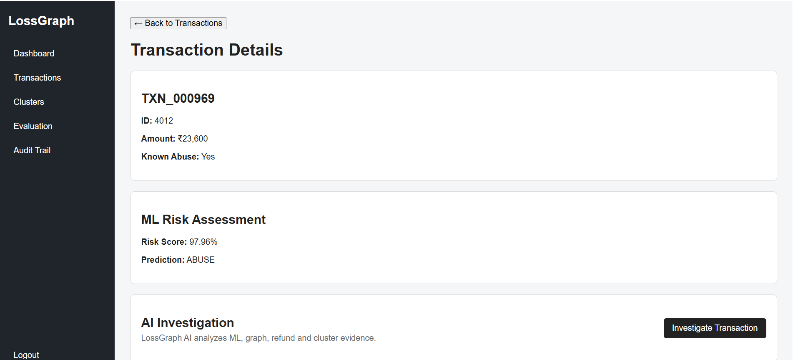
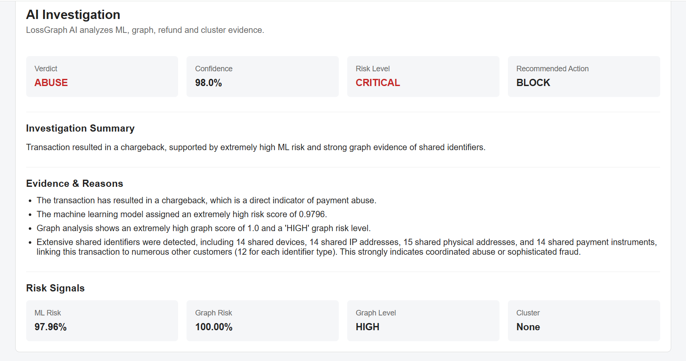
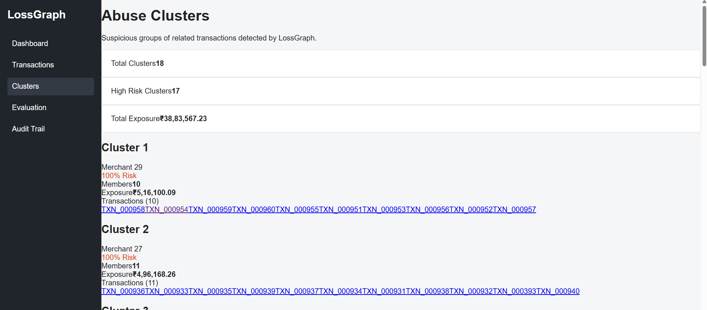
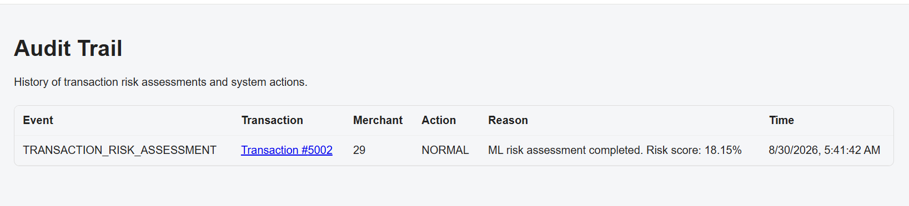

LossGraph: AI-Powered Payment Abuse Detection & Investigation

Fraud rarely happens one transaction at a time. LossGraph combines machine-learning risk scoring with graph intelligence to uncover the networks behind suspicious payments, investigate coordinated abuse, and turn risk signals into actionable decisions.

### Product Preview
### Dashboard

### Transaction Detail

### Transaction Investigation

### Cluster Explorer

### Audit Trail

The Problem

Traditional fraud detection often evaluates transactions individually.

But sophisticated payment abuse can be coordinated across multiple accounts and transactions through shared:

Devices
IP addresses
Payment instruments
Addresses
Customers
Merchants

A transaction that looks normal in isolation can become highly suspicious when viewed as part of a larger network.

LossGraph addresses this gap by combining transaction-level ML with network-level graph analysis

What LossGraph Does

LossGraph provides an end-to-end investigation workflow:

Transaction → ML Risk → Graph Analysis → Abuse Cluster → AI Investigation → Action

It can:

Detect suspicious transactions using a Random Forest risk model
Identify relationships between transactions and shared entities
Detect coordinated abuse clusters
Calculate graph-based risk scores
Quantify cluster exposure
Investigate suspicious transactions using an AI agent
Generate evidence-based explanations
Recommend an action: ALLOW, MONITOR, MANUAL REVIEW, or BLOCK
Provide evaluation metrics for the detection model

                    ┌─────────────────────┐
                    │     React + TS       │
                    │    Investigation UI  │
                    └──────────┬──────────┘
                               │
                               ▼
                    ┌─────────────────────┐
                    │       FastAPI       │
                    │      REST API       │
                    └──────────┬──────────┘
                               │
              ┌────────────────┼────────────────┐
              ▼                ▼                ▼
       ┌─────────────┐  ┌─────────────┐  ┌─────────────┐
       │     ML      │  │    Graph    │  │ PostgreSQL  │
       │ Risk Model  │  │  Analysis   │  │  Database   │
       └──────┬──────┘  └──────┬──────┘  └─────────────┘
              │                │
              └────────┬───────┘
                       ▼
              ┌──────────────────┐
              │ AI Investigation │
              │      Agent       │
              └────────┬─────────┘
                       ▼
              ┌──────────────────┐
              │ Verdict + Risk + │
              │ Evidence + Action│
              └──────────────────┘

How Investigation Works

For a suspicious transaction, LossGraph combines multiple evidence sources:

1. Transaction Evidence

Amount, status, customer, merchant, refund and chargeback information.

2. Machine Learning

A Random Forest classifier produces a transaction-level abuse probability.

3. Graph Intelligence

Relationships between transactions and shared entities are analyzed to identify signals such as:

Shared device activity
Shared IP addresses
Shared addresses
Shared payment instruments
Connected transactions
4. Abuse Clusters

Related suspicious transactions are grouped into clusters, allowing investigators to see the broader pattern rather than one isolated transaction.

5. AI Investigation

The AI investigation layer receives the structured evidence and produces:

Verdict
Confidence
Risk Level
Reasons
Recommended Action

The AI is used to investigate and explain evidence, rather than blindly determining risk from unstructured input

Model Evaluation

LossGraph was evaluated on a held-out synthetic dataset.

Metric	Result
Accuracy	99.50%
ROC-AUC	1.00
Precision	100.00%
Recall	93.75%
F1 Score	96.77%
Abuse-class performance
Metric	Result
Precision	100.00%
Recall	93.75%
F1 Score	96.77%

Note: These results are from a synthetic evaluation dataset and should not be interpreted as production fraud-detection performance.

Tech Stack

**Frontend:** React, TypeScript, Vite  
**Backend:** FastAPI, Python, SQLAlchemy  
**Database:** PostgreSQL  
**ML:** scikit-learn, Random Forest  
**Graph:** Network analysis  
**AI:** Google Gemini

